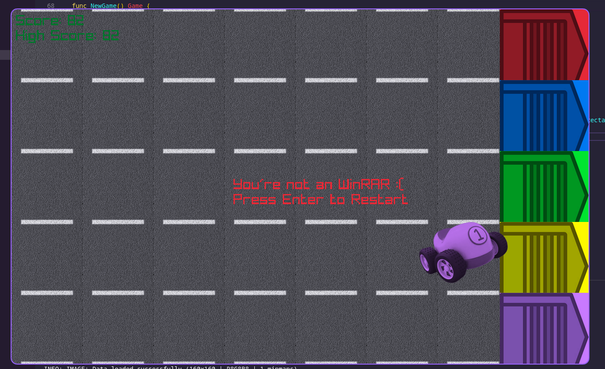

# autogo
The silly Raylib cargame I made in C but in Go for my champ

## Installation
1. Install Go on your system if you haven't already. You can download the latest version from the [official Go website](https://golang.org/dl/).
2. Clone this repository using Git:
```bash
git clone https://gitea.boner.be/bdnugget/autogo.git
```
3. Navigate to the project directory:
```bash
cd autogo
```
4. Run the following command to download and install the required dependencies:
```
go mod download
```
5. Build and run the game using the following command:
```
go run main.go
```
This should launch the game window, and you can start playing!

## Screenshot



### Note to self garage texture and other ImageMagicks
changed saturation to 10% to make Raylib tint work well enough, using ImageMagick:
```convert garage.png -resize 200x200! -channel A -evaluate multiply 0.5 +channel -modulate 100,25,100 garage_200px.png```